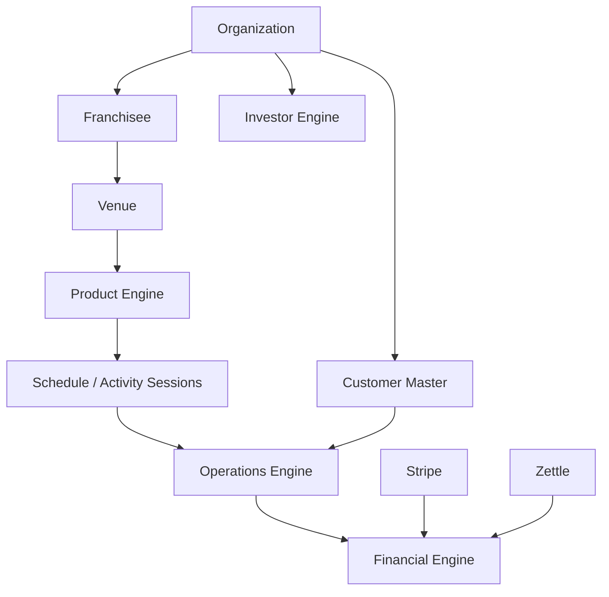
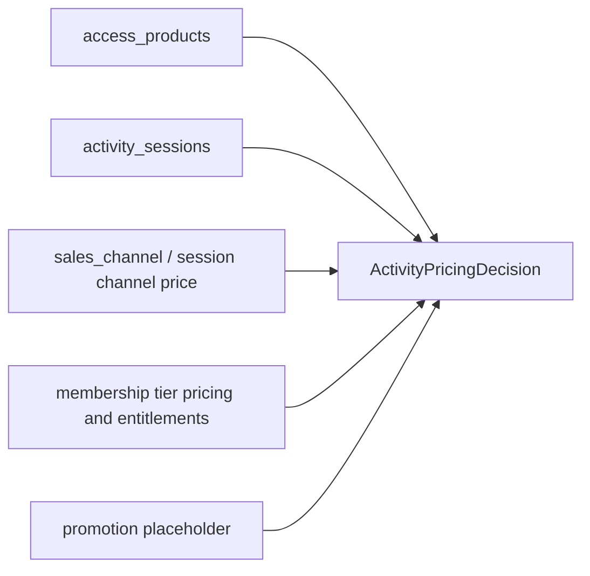

# Pickla

Pickla is a community-first sports venue platform and operating system.

It now runs as **Pickla OS**: a multi-surface platform for venue operations, desk staff, customer access, activity tickets, memberships, revenue evidence, investor access, and the public player experience.

This README is written for a new technical leader who needs the current architecture truth quickly. The canonical coding-agent guide remains [AGENTS.md](./AGENTS.md).

## Platform Status

### Foundation

Implemented:

- Organization: `organizations` exists as the brand/HQ tenant root. Existing venues are attached to the Pickla organization.
- Franchisee: `franchisees` exists between organization and venue. Current first-party venues are attached to the Pickla Solna AB franchisee row.
- Customer Master: `customers`, `customer_identities`, and `customer_venue_profiles` exist. Deterministic backfill links auth-backed profiles, Stripe customer ids, phone/email identities, and venue-local customer profile rows.
- Shared Authorization: `supabase/functions/_shared/authorization.ts` provides shared user, super-admin, organization, venue, authorized-venue, and audit helpers. It is actively used by newer admin/investor/day-pass paths and is the required path for new mutations.
- Audit Log: `audit_log` exists, is append-only, is scoped by organization/franchisee/venue, and records selected mutations. Coverage is partial, not universal.
- Customer 360: the staff drawer resolves customer identity through `customer_id` and compatibility `user_id` paths, then aggregates access, bookings, activities, memberships, receipts, ledger rows, and local financial timeline data.

### Operations

Implemented:

- Desk OS: `/desk` is the live staff cockpit for command search, arrivals, bookings, activity registrations, check-ins, operational suggestions, booking drawers, and Customer 360.
- Operations Truth: Admin Calendar, Admin Today, Desk Today, booking drawers, and display surfaces read the same operational objects: bookings, activity sessions, registrations, resource blocks, events, drift/overrides, check-ins, receipts, and ledger evidence.
- Self Check-in: `/checkin/:venueSlug` resolves booking, activity ticket, day pass, and membership access through `api-checkins/self`; check-ins are idempotent and visible to Desk.
- Activity Ticket Operations: activity sessions, session registrations, session-date capacity, attendance/check-in, activity pricing decisions, and paid/free checkout paths are live.
- Shared Pass Claim flow: `/pass/:token`, `day_pass_shares`, `access_vouchers`, and `api-day-passes/claim` support gift/shared pass claim flows that survive login/signup redirects and write audit where available.
- Revenue Ledger: `ledger_entries` is the append-only daily sales truth for Stripe-finalized Pickla sales and imported Zettle purchases.
- Zettle import: venue-level connection/import endpoints in `api-admin` import Zettle purchases into `zettle_purchases` and `ledger_entries`. The MVP is purchase totals only, with no automatic customer matching.

### Financial Operations 1A

Implemented:

- Universal Channel Pricing: products, session prices, online/desk channel prices, membership rules, day access, and activity pricing decisions are resolved through shared Product Engine pricing helpers for activity ticket flows.
- Pricing simulator: Admin Pricing includes a Product Engine simulator: product -> membership -> channel -> promotion -> final price. It is read-only and mutates nothing.
- Customer 360 Financial: Customer 360 shows lifetime ledger amount, receipts, subscriptions, linked payments, and local financial timeline rows.
- Subscription Center (read-first): Customer 360 displays locally known membership/subscription data, Stripe ids, period data, card snapshots where available, and payment history from receipts/ledger. Mutating actions such as retry/cancel are deliberately not live Stripe operations yet.
- Financial Timeline (local): Customer 360 builds a local timeline from receipts, ledger entries, memberships, activity registrations, and day passes. It is not a full event-sourced finance timeline yet.
- Revenue integration: Stripe Checkout completion writes booking receipts and ledger entries. Zettle purchase import writes ledger entries.
- Desk pricing: activity ticket checkout can carry `sales_channel = desk`, and session metadata can expose `desk_price_sek` beside online pricing.

### Product Engine Phase 1

Implemented:

- Products as primary abstraction: `access_products` defines sellable venue products such as day access, open play slot, group training, day-access voucher, and membership-like products.
- Schedule references product: `activity_sessions.product_key` links scheduled occurrences to the product being sold.
- Pricing owned by Product Engine: `supabase/functions/_shared/activity_pricing.ts` resolves product, session, channel, membership, and entitlement decisions for activity tickets and day access.
- Schedule owns time/capacity: `activity_sessions` owns date/recurrence, start/end, capacity, courts, publish status, and overrides.
- Product owns pricing: `access_products.base_price_sek` is the fallback/default product price; concrete sessions can override via `activity_sessions.price_sek` and metadata.
- Value-first customer pricing: public program/session UI prioritizes included access, day pass inclusion, membership inclusion, member discounts, savings, and final customer price over raw product mechanics.

### Investor Platform

Implemented:

- Investor Access: `/invest` collects investor requests in `investor_leads`; approved leads receive tokenized memo access at `/invest/memo/:token`.
- Investor CMS: `/hub/admin/investors` lets super admins manage investor leads and editable investor content.
- Investor Assets: `investor_assets` plus public `investor-assets` storage support logos, hero assets, venue photos, screenshots, decks, PDFs, and other round assets.
- Investor Memorandum: `investor_settings` stores round terms, thesis, traction, risks, team, and memo sections. Private memo content is returned only after token validation.
- Admin investor management: approve, reject, revoke, content edit, and asset toggle/upload flows are available through `api-investor`, with audit logging on selected mutations.

## Current Architecture



### Frontend

- React 18, TypeScript, Vite.
- Tailwind CSS, shadcn/ui, Radix UI, Framer Motion.
- TanStack React Query for server state.
- React Router routes live in [src/App.tsx](./src/App.tsx).
- API calls go through [src/lib/api.ts](./src/lib/api.ts) to Supabase Edge Functions.
- Auth state lives in [src/hooks/useAuth.tsx](./src/hooks/useAuth.tsx).
- Timezone-sensitive UI should use Luxon and Europe/Stockholm.

Important surfaces:

- Public player app: `/`, `/today`, `/book`, `/openplay`, `/program/:sessionId`, `/my`, `/hub`.
- Desk OS: `/desk`.
- Admin OS: `/hub/admin`.
- Admin investor management: `/hub/admin/investors`.
- Investor access: `/invest`, `/invest/memo/:token`.
- Event lead operations: `/admin/event-leads`.
- Self check-in: `/checkin/:venueSlug`.
- Displays: `/display/venue`, `/display/openplay`, `/display/resource/:courtId`, `/display/device/:token`, `/display/broadcast/:scoreSessionId`.

### Supabase

Supabase provides:

- PostgreSQL source of truth.
- Auth.
- Realtime subscriptions for live check-ins, bookings, chat, and display surfaces.
- Edge Functions for all server logic.
- Storage for generated PDFs/media and investor assets where used.

All operational data remains venue-scoped through `venue_id`. Foundation tables now add organization/franchise/customer ancestry, but several runtime flows still keep compatibility `user_id` and venue-local membership fields.

### Edge Functions

Edge Functions are in [supabase/functions](./supabase/functions). They are Deno functions and are deployed with `--no-verify-jwt`; authentication is performed manually inside functions via `getAuthenticatedClient(req)` and Supabase Auth.

Important functions:

| Function | Purpose |
| --- | --- |
| `api-admin` | Admin aggregate API: venue/staff/courts/hours/pricing/products/schedule, Admin Today, Calendar, attention, Agent Inbox, venue operations, resource blocks, activity overrides, Revenue Ledger, Zettle connect/import. |
| `api-bookings` | Public/admin booking API, Stripe checkout creation, public venue/courts, booking receipts, wellness, admin booking CRUD, availability, activity ticket checkout, and entitlement usage updates. |
| `api-checkins` | Self check-in, booking code check-in, staff check-in, today/ops feeds, player/event check-in helpers. |
| `api-customers` | Customer list/profile/create/update/recent and Customer 360 aggregation. |
| `api-day-passes` | Day pass, share, voucher, and claim flows. |
| `api-event-public` | Public activity/session endpoints, registrations, pricing previews, event lead intake-facing flows. |
| `api-events` | Admin event CRUD, event plan sharing, public partner plan. |
| `api-investor` | Investor lead request, tokenized memo access, admin lead management, investor settings, and assets. |
| `api-memberships` | Membership tiers, tier pricing, entitlement, and member-facing/admin membership operations. |
| `api-notifications` | Push subscription and notification sending. |
| `api-ops` | Ops Center, operational health, client event, incident, checklist, and shadow-agent support. |
| `api-stripe` | Stripe customer/payment-method/setup helpers. |
| `api-stripe-webhook` | Stripe Checkout completion finalization for bookings, registrations, day passes, memberships, receipts, and ledger entries. Other Stripe event types are currently acknowledged and ignored. |
| `event-sales-agent` | Event sales workflow: recommendation, schedule patch, offer draft/PDF/email, send offer, booking preview, confirm booking. |

Shared helpers are in [supabase/functions/_shared](./supabase/functions/_shared).

## Engines

### Customer Engine

The Customer Engine is the identity and customer-history layer.

Implemented model:

- `auth.users`: authentication anchor.
- `player_profiles`: legacy/user profile fields and Stripe customer id.
- `customers`: organization-scoped customer master.
- `customer_identities`: auth/email/phone/Stripe/manual/Zettle identity links.
- `customer_venue_profiles`: venue-private customer context, first/last seen, visits, tags, and private notes.
- Nullable `customer_id` links on bookings, session registrations, day passes, memberships, receipts, ledger entries, and check-ins.

Read surfaces:

- Customer 360.
- Desk command/search and booking drawers.
- Admin customer/people paths.
- Revenue Ledger rows when a customer is known.

Current constraint: runtime still supports compatibility reads by `user_id`; not every write path is fully customer-master-first.

### Financial Engine

The Financial Engine records sales truth and customer-facing financial evidence.

Implemented model:

- `ledger_entries`: append-only daily sales truth, unique by source/session where available.
- `booking_receipts`: receipt/evidence records for Stripe finalized purchases.
- `customer_transactions`: additive finance-ledger roadmap table for Stripe/Zettle/manual/refund/Fortnox-style future flows.
- `zettle_connections` and `zettle_purchases`: Zettle purchase import state and imported purchase records.
- Customer 360 financial summaries and local financial timeline.

Current Stripe scope:

- `checkout.session.completed` finalizes bookings, registrations, day passes, memberships, receipts, entitlement usage, and ledger entries.
- `invoice.paid`, `invoice.payment_failed`, and subscription lifecycle events are not yet real synchronization sources.

### Product Engine

The Product Engine describes what is sold and how the customer price is resolved.

Implemented model:

- `access_products`: sellable products, base price, VAT, product kind, grants, and sort order.
- `activity_series`: recurring program/series grouping.
- `activity_sessions`: schedule, time, capacity, courts/resources, product key, publish status, access policy, and session metadata.
- `session_registrations`: concrete customer registration for an occurrence date.
- `access_entitlements` and `access_vouchers`: dated/reusable access and voucher-style rights.
- `membership_tier_pricing` and `membership_entitlements`: current membership benefit/pricing rules.

Pricing path:



Current constraint: Product Engine Phase 1 is implemented for activity/day-access pricing. Court booking pricing still uses `pricing_rules` and membership entitlement logic, with shared concepts but not a single universal product resolver.

### Operations Engine

The Operations Engine is the venue truth layer.

Implemented model:

- `bookings`, `venue_courts`, `event_resource_blocks`, `activity_sessions`, `session_registrations`, `activity_session_overrides`, `events`, `venue_checkins`.
- Desk OS, Admin Calendar, Admin Today, displays, and booking drawers read from shared operational sources.
- `ops_signals`, `ops_check_state`, `ops_incidents`, `ops_client_events`, and `ops_agent_runs` power Ops Center and shadow-agent health checks.
- Event operations agent recommendations are stored in `event_lead_activities` and shown in Agent Inbox.

Current constraint: there is no general Operations Inbox/work queue yet; signals and agent recommendations are split across Ops Center and Admin/Agent Inbox surfaces.

### Investor Engine

The Investor Engine is a platform-adjacent capital-raise surface.

Implemented model:

- `investor_leads`: request, approval, token hash, memo opened/interested states, requested shares, and message.
- `investor_settings`: round content, terms, use of funds, traction, risks, team, and memo sections.
- `investor_assets`: typed assets backed by public `investor-assets` storage.
- `api-investor`: public request/settings/memo endpoints plus super-admin admin endpoints.

Current constraint: this is not a cap table, share registry, KYC, payment, or document-signing system.

## Current Known Gaps

### Financial Operations 1B

Not implemented yet:

- Real Stripe subscription synchronization beyond Checkout completion.
- `invoice.paid`.
- `invoice.payment_failed`.
- Subscription snapshots from Stripe as first-class records.
- Payment method snapshots as durable finance/customer facts.
- Richer Financial Timeline based on financial/domain events instead of local aggregation.
- Full `membership_usage` integration across all pricing and finance views.

### Central Membership

Not implemented yet:

- Organization-owned membership plans as runtime source.
- Central membership records owned by `organization_id` + `customer_id`.
- `entitlement_grants` as the universal access spine.
- Runtime cutover away from venue-owned `membership_tiers`/`memberships.venue_id`.
- Cross-venue central membership reporting and revenue attribution.

### Event Outbox

Not implemented yet:

- Typed domain-event outbox for facts such as BookingConfirmed, PaymentSettled, CheckinRecorded, SessionPublished, ResourceBlocked, and LeadReceived.
- Idempotent event delivery with correlation/causation ids.
- Projection rebuild path for Operations Truth, Customer 360, Financial Timeline, and Agent Inbox.

### Operations Inbox

Not implemented yet:

- A unified staff inbox for operational exceptions across bookings, payments, check-ins, activities, events, Zettle imports, and agent recommendations.
- Assignment, status, SLA, comments, and resolution workflow.

### Shadow Agent

Partially implemented:

- Ops Center has `ops_agent_runs` and shadow checks.
- Event operations agent can recommend and staff can approve/reject/re-analyze.

Not implemented yet:

- General typed action contracts.
- Agent permissions as first-class principals.
- Would-have-done measurement across all operations.
- Kill switches by agent/capability/scope.

### Product Engine Phase 2

Not implemented yet:

- Universal product/pricing resolver for all product categories, including court bookings and memberships.
- Promotions/vouchers/referrals as real pricing entities.
- Channel pricing tables beyond current session metadata and simulator placeholders.
- Product-owned entitlements replacing scattered membership/product logic.
- Admin editing that guarantees public UI, desk UI, and backend checkout are always driven by the same resolver for every product.

### Native Apps (future)

Not implemented yet:

- Native iOS/Android apps.
- Native push/deep-link handling beyond the current PWA and web push setup.
- App-store distribution, native offline access, and native scanner/display shells.

## Production Status

Live today:

- Public booking and booking confirmation.
- Court availability with resource-block awareness.
- Public venue/opening-hours display with drift overrides.
- Activity/session listing, sharing, interest/social proof, and registration.
- Activity occurrence hiding/cancellation through overrides.
- Specialpass one-off public sessions with per-session/channel pricing display.
- Membership checkout and entitlement logic.
- Day passes, shared passes, and claim flow.
- Self check-in route and desk-visible check-ins.
- Staff check-in for bookings, activity tickets, memberships, and day access.
- Desk OS command/search/action surface.
- Admin OS Today, Calendar, Venue Operations, Resource Blocks, Products, Pricing, Schedule, Revenue Ledger.
- Customer 360 with financial/subscription read-first surfaces.
- Event lead intake, offer generation, PDF/email drafts, confirm booking, event capacity blocks.
- Agent recommendations for event operations.
- Zettle purchases import into Revenue Ledger.
- Investor access, investor CMS, investor assets, and investor memorandum.
- Hub/chat/community surfaces.
- Venue/resource displays.
- Score/broadcast MVP.

Important production notes:

- Frontend is deployed by Vercel from `main`.
- Supabase project ref in this repo is `cqnjpudmsreubgviqptg`.
- Edge Functions need manual deploy.
- Migrations are applied manually and PostgREST schema cache should be reloaded after SQL editor changes.
- Do not commit Supabase `.temp` files.

## Deployment And Environment

Commands:

```bash
npm run dev
npm run build
npm run lint
npm run test
```

Environment requires a `.env` file with:

```bash
VITE_SUPABASE_URL=...
VITE_SUPABASE_PUBLISHABLE_KEY=...
VITE_SUPABASE_PROJECT_ID=...
```

Supabase secrets required where features are enabled:

- `STRIPE_SECRET_KEY`
- `STRIPE_WEBHOOK_SECRET`
- `VAPID_PUBLIC_KEY`
- `VAPID_PRIVATE_KEY`
- Zettle credentials as configured by `api-admin`

Deploy process:

- Frontend: `git push` to `main` deploys through Vercel.
- Edge Functions: `supabase functions deploy --no-verify-jwt --project-ref cqnjpudmsreubgviqptg`.
- Migrations: run manually in Supabase SQL editor, then run `NOTIFY pgrst, 'reload schema'`.

## Development Rules

- Make small targeted changes.
- No production code changes when updating architecture documentation.
- Use Luxon for venue-day and timezone-sensitive logic.
- All server state should flow through React Query and Edge Functions.
- New mutations should use shared authorization helpers and write audit where practical.
- Never commit secrets.
- Never commit Supabase `.temp` files.
- Run `npm run build` before commits for application changes. Documentation-only changes do not require a build.
- Run `git diff --check` before handing off documentation changes.
