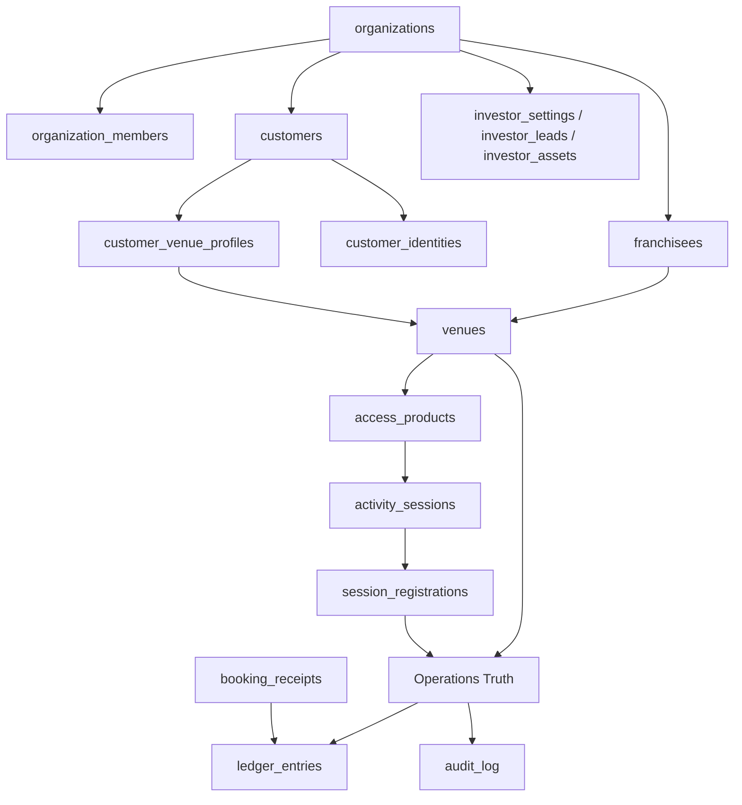
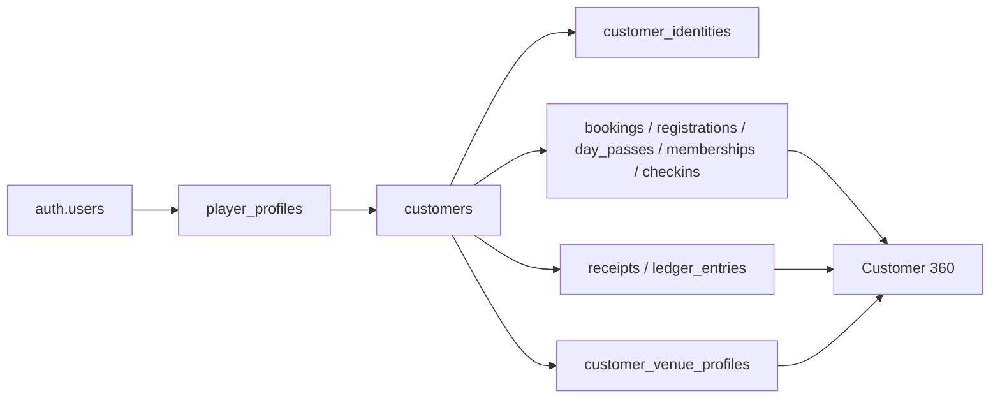

# Architecture Foundation Phase 1

Status: implemented foundation with compatibility runtime
Scope: organization/franchise/customer/authorization/audit foundation plus current engine context
Last updated: 2026-07-03

This document used to be the implementation plan for Foundation Phase 1. It is now the current-state architecture record for the foundation that has been implemented and the remaining cutovers that are still open.

Do not treat older "Phase 1 will create..." notes as current truth. The foundation exists, but not every runtime flow has been cut over to use it as the only source.

## Platform Status

### Foundation

Implemented:

- `organizations`: brand/HQ tenant root.
- `franchisees`: legal/operator layer under organization.
- `venues.organization_id` and `venues.franchisee_id`: venue ancestry.
- `organization_members`: organization-level staff roles.
- Customer Master: `customers`, `customer_identities`, and `customer_venue_profiles`.
- Nullable `customer_id` links on key operational records.
- Shared authorization module: `supabase/functions/_shared/authorization.ts`.
- `audit_log`: append-only scoped audit surface.
- Customer 360: reads customer master where possible and falls back to legacy `user_id` paths.

Still compatibility-first:

- Supabase Auth remains the login anchor.
- `player_profiles` remains a live compatibility/profile table.
- Booking, check-in, Stripe, and membership runtime still use a mix of `user_id`, `customer_id`, and venue-local membership fields.
- Audit coverage is partial.
- Organization/franchise authorization exists, but older code paths may still use legacy venue checks.

### Operations

Implemented:

- Desk OS: live command and arrival cockpit at `/desk`.
- Operations Truth: shared booking/activity/event/resource/check-in data visible across Admin Calendar, Admin Today, Desk, displays, and drawers.
- Self Check-in: customer-led QR check-in through `/checkin/:venueSlug`.
- Activity Ticket Operations: `activity_sessions`, `session_registrations`, capacity, attendance, and check-in.
- Shared Pass Claim flow: `/pass/:token`, `day_pass_shares`, `access_vouchers`, and `api-day-passes/claim`.
- Revenue Ledger: append-only `ledger_entries`.
- Zettle import: `zettle_connections`, `zettle_purchases`, and ledger integration.

### Financial Operations 1A

Implemented:

- Universal Channel Pricing for activity/day-access flows.
- Admin Product Engine pricing simulator.
- Customer 360 Financial summary.
- Subscription Center (read-first) inside Customer 360.
- Financial Timeline (local aggregation) inside Customer 360.
- Revenue integration from Stripe Checkout completion and Zettle import.
- Desk pricing support through `sales_channel = desk` and session `desk_price_sek` metadata.

### Product Engine Phase 1

Implemented:

- Products as primary abstraction through `access_products`.
- Schedule references product through `activity_sessions.product_key`.
- Pricing owned by Product Engine for activity/day-access flows through `_shared/activity_pricing.ts`.
- Schedule owns time/capacity through `activity_sessions`.
- Product owns default/fallback pricing through `access_products.base_price_sek`.
- Value-first customer pricing in public session UI.

Compatibility state:

- Court booking pricing still uses `pricing_rules` and booking-specific membership entitlement logic.
- Membership plans are not yet organization-owned runtime products.
- Promotions/referrals/campaigns are simulator placeholders, not real pricing entities.

### Investor Platform

Implemented:

- Investor Access: `/invest` and tokenized `/invest/memo/:token`.
- Investor CMS: `/hub/admin/investors`.
- Investor Assets: `investor_assets` and `investor-assets` storage.
- Investor Memorandum: editable `investor_settings`.
- Admin investor management through `api-investor`.

## Current Architecture



The foundation is additive. It did not rewrite the whole platform around organization/customer/product in one cutover. Current runtime therefore has two layers:

- New foundation layer: organization, franchisee, customer, shared authorization, audit.
- Compatibility/runtime layer: existing venue-scoped booking, check-in, membership, Stripe, activity, and ledger flows.

## Implemented Foundation Model

### Organization

Definition: brand/HQ owner of identity, global policy, investor platform, reporting, and future central membership ownership.

Table: `organizations`

Key fields:

- `id`
- `name`
- `slug`
- `legal_name`
- `org_number`
- `default_currency`
- `default_country`
- `settings`
- `status`
- `created_at`
- `updated_at`

Current behavior:

- The Pickla organization is backfilled.
- Existing venues are attached through `venues.organization_id`.
- Organization membership is used by shared authorization and scoped RLS.

### Franchisee

Definition: operator/legal entity under an organization. A franchisee owns one or more venues operationally and financially.

Table: `franchisees`

Key fields:

- `id`
- `organization_id`
- `legal_name`
- `slug`
- `org_number`
- `stripe_account_id`
- `payout_currency`
- `vat_rate`
- `revenue_share_pct`
- `status`
- `metadata`
- `created_at`
- `updated_at`

Current behavior:

- A first-party Pickla Solna AB franchisee exists.
- Existing venues are attached through `venues.franchisee_id`.
- `stripe_account_id` is a future home for Stripe Connect, not active runtime behavior.

### Venue

Definition: physical operating location.

Current table: `venues`

Foundation fields:

- `organization_id`
- `franchisee_id`

Current behavior:

- Venue remains the operational tenant for bookings, courts/resources, check-ins, schedules, activity tickets, displays, staff access, Zettle connection, and ledger attribution.
- Organization/franchisee ancestry is available for future HQ/franchise reporting and central membership.

### Organization Members

Definition: organization-level staff role membership.

Table: `organization_members`

Roles:

- `owner`
- `admin`
- `ops`
- `finance`
- `support`

Current behavior:

- Super admins and existing active venue staff were backfilled into organization membership.
- Shared authorization can derive authorized venue ids from organization membership.

### Customer Master

Definition: canonical customer identity under an organization. It is not the same thing as `auth.users`.

Table: `customers`

Key fields:

- `id`
- `organization_id`
- `auth_user_id`
- `display_name`
- `first_name`
- `last_name`
- `primary_email`
- `primary_phone`
- `email_normalized`
- `phone_e164`
- `marketing_consent`
- `consent_at`
- `merged_into_id`
- `status`
- `metadata`
- `created_at`
- `updated_at`

Supporting tables:

- `customer_identities`: auth/email/phone/Stripe/Zettle/manual identity links.
- `customer_venue_profiles`: venue-private profile, home venue, first/last seen, visit count, notes, tags.

Backfilled links:

- One customer per deterministic auth-backed `player_profiles.auth_user_id`.
- Auth identity.
- Email identity from `auth.users.email`.
- Phone identity from `player_profiles.phone`.
- Stripe identity from `player_profiles.stripe_customer_id`.
- Venue profiles from preferred venue and linked bookings, registrations, day passes, memberships, receipts, and check-ins.

Current behavior:

- `player_profiles.customer_id` links legacy profile to customer master.
- Key operational tables have nullable `customer_id`.
- Customer 360 can resolve by `customer_id` or legacy `user_id`.
- Newer checkout/webhook code resolves customer ids where practical.

Current constraint:

- No aggressive merge/dedupe.
- Zettle purchases are not auto-matched to customers.
- Not every new operational write is guaranteed to populate `customer_id`.

## Shared Authorization

Implemented module:

```text
supabase/functions/_shared/authorization.ts
```

Implemented helpers include:

- `requireUser(req)`
- `isSuperAdmin(admin, userId)`
- `requireSuperAdmin(admin, userId)`
- `requireVenueRole(admin, userId, venueId, roles)`
- `requireOrganizationRole(admin, userId, organizationId, roles)`
- `canOperateVenue(admin, userId, venueId)`
- `getAuthorizedVenueIds(admin, userId)`
- `writeAuditLog(admin, row)`
- `auditMutation(admin, input)`

Current rule:

Every new venue mutation should authorize the specific target venue or organization. Avoid "admin somewhere" checks.

Current rollout:

- Used by newer `api-admin` paths, `api-investor`, day-pass claim audit paths, and other selected mutations.
- Still needs broader adoption across older Edge Function mutation paths.

## Audit Log

Implemented table: `audit_log`

Fields:

- `id`
- `organization_id`
- `franchisee_id`
- `venue_id`
- `actor_user_id`
- `actor_type`: `user`, `system`, `webhook`, `agent`
- `action`
- `entity_table`
- `entity_id`
- `request_id`
- `before`
- `after`
- `metadata`
- `ip`
- `user_agent`
- `created_at`

Implemented rules:

- Service-role insert policy.
- No update/delete through triggers.
- Venue-admin scoped reads.
- Organization-admin scoped reads.
- Super-admin reads.

Current coverage:

- Selected `api-admin` mutations.
- Selected investor mutations.
- Day pass shared-claim audit when the table exists.
- Event/agent flows where wired.

Current gap:

- Audit parity is not complete for every Stripe webhook, booking, check-in, membership, event, notification, or admin mutation.
- `audit_log` is not the full domain event log.

## Customer Engine

Purpose: one customer identity and history spine across auth, bookings, activities, passes, memberships, receipts, ledger, and venue-private profile context.

Implemented read model:



Customer 360 currently shows:

- Name, email, phone.
- Membership/access status.
- Today's access.
- Upcoming bookings.
- Activity registrations.
- Day passes.
- Memberships.
- Check-ins.
- Receipts.
- Ledger entries.
- Financial summary.
- Subscription Center read-first.
- Local Financial Timeline.
- Safe existing staff actions.

## Financial Engine

Purpose: sales truth, receipts, customer financial visibility, and future finance-ledger foundation.

Implemented:

- `ledger_entries`: append-only daily sales truth.
- `booking_receipts`: customer-facing receipt/evidence rows.
- `customer_transactions`: additive future finance ledger table.
- `zettle_connections`: venue-level Zettle connection state.
- `zettle_purchases`: imported Zettle purchase rows.
- Customer 360 financial summary, subscription read model, and local financial timeline.

Current sources:

- Court bookings.
- Activity/session registrations.
- Day passes.
- Membership checkout.
- Zettle purchases.

Current Stripe behavior:

- `api-stripe-webhook` finalizes `checkout.session.completed`.
- Other Stripe event types are acknowledged and ignored.

Known constraint:

- Financial Operations 1A is implemented; 1B subscription synchronization is not.
- `customer_transactions` is present but not the primary ledger used by the product.
- `ledger_entries` has no line-item or reversal/correction model.

## Product Engine

Purpose: describe what is sold and resolve value-first customer pricing.

Implemented tables:

- `access_products`
- `activity_series`
- `activity_sessions`
- `session_registrations`
- `access_entitlements`
- `access_vouchers`
- `membership_tier_pricing`
- `membership_entitlements`
- `membership_usage`

Implemented pricing path:

- Product base/fallback price from `access_products.base_price_sek`.
- Concrete schedule price from `activity_sessions.price_sek`.
- Channel price from session metadata such as `online_price_sek` and `desk_price_sek`.
- Membership inclusion/discount from active membership, entitlements, and tier pricing.
- Day-access inclusion from active `access_entitlements`.
- Debuggable backend decision from `_shared/activity_pricing.ts`.

Important rule:

For activity/program sessions, prefer `activity_sessions.price_sek` and session metadata before `access_products.base_price_sek`. The product base price is the fallback/default, not the concrete occurrence price when the session has a price.

Current gap:

- Court booking pricing and membership checkout are not fully moved to a universal Product Engine resolver.

## Operations Engine

Purpose: live venue truth across desk, admin, displays, check-in, bookings, activities, events, and agent support.

Implemented operational sources:

- `bookings`
- `venue_courts`
- `activity_sessions`
- `session_registrations`
- `activity_session_overrides`
- `activity_session_interests`
- `access_entitlements`
- `access_vouchers`
- `day_passes`
- `memberships`
- `venue_checkins`
- `events`
- `event_leads`
- `event_resource_allocations`
- `event_resource_blocks`
- `ops_signals`
- `ops_check_state`
- `ops_incidents`
- `ops_client_events`
- `ops_agent_runs`

Implemented surfaces:

- Desk OS.
- Admin Calendar.
- Admin Today.
- Operations booking drawer.
- Self Check-in.
- Displays.
- Ops Center.
- Agent Inbox for event recommendations.

Current gap:

- No unified Operations Inbox exists yet.
- Ops Center incidents/signals and event agent recommendations are related but separate.

## Investor Engine

Purpose: investor access and editable fundraising narrative.

Implemented tables:

- `investor_leads`
- `investor_settings`
- `investor_assets`

Implemented surfaces:

- `/invest`
- `/invest/memo/:token`
- `/hub/admin/investors`

Implemented API:

- `api-investor/settings`
- `api-investor/request`
- `api-investor/memo`
- `api-investor/leads`
- `api-investor/admin-settings`
- `api-investor/save-settings`
- `api-investor/save-asset`
- `api-investor/approve`
- `api-investor/reject`
- `api-investor/revoke`

Current constraints:

- Super-admin managed.
- Tokenized memo access, not a legal/KYC/cap-table/payment system.

## Central Membership Status

Original target remains valid:

```text
organization
  -> customer
      -> central membership
          -> entitlement grant
              -> entitlement usage at venue
```

Current runtime:

- `membership_tiers` and `memberships` remain venue-scoped.
- `membership_entitlements` and `membership_usage` remain current entitlement/quota runtime.
- `memberships.customer_id` exists as an additive link.
- Membership checkout still uses Stripe Checkout and venue-local tier ids.

Not implemented yet:

- `membership_plans` as organization-owned runtime catalog.
- `membership_plan_venues`.
- `plan_entitlements`.
- `entitlement_grants` as the universal access source.
- Organization-owned central membership runtime.
- Cross-venue central membership cutover.

## Future AI-First Direction

The future direction is still resource-first and event-driven, but it is not implemented as a general autonomous architecture.

### Resource-First Architecture

Future target:

- `playable_resource`: anything a session can happen on.
- `resource_container`: operating context that groups resources.
- `venue`: one concrete container type.

Current implementation:

- `venue_courts` remains the concrete playable resource table.
- `event_resource_catalog`, `event_resource_allocations`, and `event_resource_blocks` support event planning and capacity blocking.
- Generic resource containers are not implemented.

### Host/Ambassador/Affiliate Progression

Future target:

```text
customer
  -> host
  -> ambassador
  -> affiliate
  -> operator
  -> franchisee
```

Current implementation:

- Product/pricing simulator names channels such as `host`, `ambassador`, `affiliate`, and `corporate`.
- These are not yet real principal types, payout systems, or scoped capabilities.

### Event Outbox

Future target:

- Immutable domain facts such as `BookingConfirmed`, `CheckinRecorded`, `PaymentSettled`, `LeadReceived`, `SessionPublished`, and `ResourceBlocked`.
- Typed, versioned, idempotent, append-only.
- Correlation and causation ids.
- Projection rebuilds for Operations Truth, Customer 360, Revenue Ledger summaries, Financial Timeline, and Agent Inbox.

Current implementation:

- `audit_log` exists for mutation traceability.
- `ops_client_events` exists for operational/client signals.
- Event agent recommendations exist in `event_lead_activities`.
- There is no general domain-event outbox yet.

### Agent Contracts And Permissions

Future target:

- Agents are principals with scoped capabilities.
- Agents consume typed events and emit typed proposed actions.
- Every action has preconditions, effect class, blast radius, and approval policy.

Current implementation:

- Event operations agent is approval-first.
- Ops Center has shadow-agent checks and `ops_agent_runs`.
- No general agent permissions, action gateway, or policy engine exists yet.

## Current Known Gaps

### Financial Operations 1B

Missing:

- Real Stripe subscription synchronization.
- `invoice.paid`.
- `invoice.payment_failed`.
- Subscription snapshots.
- Payment method snapshots.
- Richer Financial Timeline.
- Full `membership_usage` integration across finance/customer views.

### Central Membership

Missing:

- Organization-owned membership plan runtime.
- Central membership subscription/access table.
- Universal entitlement grants.
- Cross-venue plan honoring and revenue attribution.
- Venue-local membership compatibility removal.

### Event Outbox

Missing:

- Domain-event outbox table.
- Idempotent event delivery.
- Projection rebuild support.
- Correlation/causation ids across all workflows.

### Operations Inbox

Missing:

- One staff work queue for payment exceptions, access problems, stale check-ins, activity attendance gaps, event conflicts, Zettle import issues, and agent recommendations.
- Assignment, status, comments, SLA, and resolution model.

### Shadow Agent

Partially implemented:

- Event recommendations.
- Ops Center shadow checks.
- `ops_agent_runs`.

Missing:

- Typed action contracts.
- Agent-as-principal authorization.
- Would-have-done metrics across operations.
- Kill switches by agent/capability/venue/organization.

### Product Engine Phase 2

Missing:

- Universal resolver for all products, including court booking and memberships.
- Promotions/referrals/campaigns as first-class pricing entities.
- Channel pricing tables beyond session metadata and simulator placeholders.
- Product-owned entitlements replacing scattered special logic.
- Full admin guarantees that public UI, desk UI, and checkout use exactly the same resolver for every product.

### Native Apps

Future only:

- Native iOS/Android apps.
- Native push/deep-link handling beyond PWA web push.
- Native scanner/display shells.
- App store distribution and native offline behavior.

## Acceptance Status

Foundation Phase 1 acceptance:

- Every venue belongs to an organization and franchisee: implemented for existing venues through migration/backfill.
- Existing staff can still access venues: implemented through additive organization membership and existing venue_staff compatibility.
- Shared authorization helpers exist: implemented.
- Customer master exists and is backfilled from `player_profiles`: implemented.
- Key operational tables have nullable `customer_id`: implemented.
- Customer 360 can resolve customer via `customer_id` or compatibility fallback: implemented.
- `audit_log` exists and is append-only: implemented.
- Current booking, check-in, membership, Stripe Checkout, ledger, Event OS, Desk OS, and Admin OS flows remain compatible: implemented.

Still not complete:

- Player profile public-read lockdown is not documented here as complete unless verified in deployed RLS.
- Audit coverage is not universal.
- Event domain split/filtering is not treated as complete current architecture.
- Central membership runtime cutover is not complete.
- Stripe subscription event synchronization is not complete.
- Ledger reversal/line-item model is not complete.

## Implementation Notes For Future Sessions

- Keep foundation changes additive until a specific cutover plan exists.
- Prefer `customer_id` when present, but preserve `user_id` compatibility where production runtime still needs it.
- Use `_shared/authorization.ts` for new mutations.
- Write `audit_log` for new staff/admin/agent/customer-impacting mutations where practical.
- Do not auto-merge uncertain customers.
- Do not auto-match Zettle purchases to customers.
- Do not mix central membership rollout with Stripe subscription synchronization unless the cutover plan explicitly covers both.
- Do not introduce Stripe Connect until franchise settlement and ledger reversal models are ready.
- Run `git diff --check` after documentation changes.
